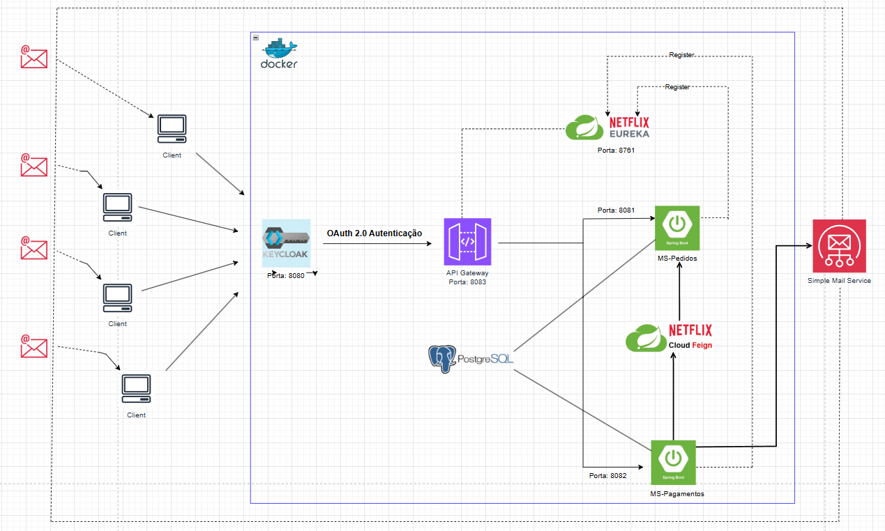

<h1 align="center">
  Microsservices-Payments
</h1>


## Tecnologias Utilizadas

- Spring Boot, Security, Data e Cloud
- Keycloak
- JPA
- Postgres
- Feign Client
- Eureka Server
- API Gateway
- Docker Compose
- Mail Sender
- Junit5
- Swagger

## Como Executar a API

- Clonar repositório git:
```
- git clone https://github.com/lebuffet02/microsservices-payments.git
```
- Executar o Keycloak:
```
- docker-compose up
```
- Executar a API nesta ordem:
```
- Acessar a classe Main (EurekaApplication), clicar no botão verde e depois em 'Run'.
- Acessar a classe Main (GatewayApplication), clicar no botão verde e depois em 'Run'.
- Acessar a classe Main (PedidosMSApplication), clicar no botão verde e depois em 'Run'.
- Acessar a classe Main (PagamentosMSApplication), clicar no botão verde e depois em 'Run'.
```

- Após subir os 4 serviços, acesse:
```
http://localhost:8761/
Acessar o Swagger da API de Pedidos: http://localhost:8081/swagger-ui/index.html#/
Acessar o Swagger da API de Pagamentos: http://localhost:8082/swagger-ui/index.html#/
```

- Como Gerar o Bearer Token no keycloak?

```
No terminal, execute: docker-compose up. Em seguida, acesse a url: http://localhost:8080/ com as
credenciais, "admin", "admin". Depois, no canto superior esquerdo, vá em 'keycloak' e depois 
'create realm'. Após isso, importe o realm.json que está localizado em src/main/resources/ 
de pagamentos-ms ou pedidos-ms.

Realizado estes passos, vá em 'users' no canto esquerdo e depois, 'create new user'. Ative o 
'email verified' e adicione um username. Após criar o usuário, clique em 'credentials' e 'set password'.
 Desative o 'temporary' e adicione uma senha para ele. Por fim, ao lado de 'credentials', em 'role mapping',
 clique em 'assign role' e ative 'USER' ou 'ADMIN' de acordo com o tipo de Bearer token que você esteja 
 buscando gerar.
```

- Gerar Bearer Token via Postman:

```
Após finalizar as etapas anteriores, com o postman aberto e com o serviço em execução, 
acesse para gerar o token do tipo USER, substituindo username e password:

curl --location 'http://localhost:8081/token' \
--header 'Content-Type: application/json' \
--data '{
    "clientId": "client",
    "username": "USUÁRIO DEFINIDO AO CRIAR USUÁRIO NO KEYCLOAK",
    "password": "SENHA DEFINIDA AO CRIAR USUÁRIO NO KEYCLOAK",
    "grantType": "password"
}'  
```

```
Por fim, no postman, acesse um endpoint que peça role do tipo USER, como por exemplo:
GET http://localhost:8083/pagamentos-ms/api/pagamentos
Clique em 'Authorization', em Bearer Token e cole o token gerado no curl acima. Após isso é só
clicar em send que você verá esse response: [] 
```


- Como utilizar o API-Gateway?
```
Para fazer uso do api-gateway dos endpoints de ambas APIs, primeiramente você deverá estar 
autenticado via keycloak com oauth 2.0. Mas para teste você poderá acessar o endpoint de status do
mc-pedidos da seguinte forma: http://localhost:8083/pedidos-ms/health
```


## Arquitetura

A arquitetura foi do tipo Model-View-Controller (MVC), de modo que o usuário realiza
uma request através do endpoint /token que irá devolver o bearer token através do keycloak.
Dessa forma, o bearer deve ser repassado no authorization de cada um dos endpoints.

Segue abaixo o modelo da arquitetura:




## Envio de Emails

```
- Para a realização de envio de emails, eu acabei utilizando o host do gmail, mais especificamente "spring.mail.host=smtp.gmail.com",
junto com a propriedade e porta "spring.mail.port=587". Segue abaixo o exemplo utilizado para realizar o envio de emails.

    spring.mail.host=smtp.gmail.com
    spring.mail.port=587
    spring.mail.username= email do remetente
    spring.mail.password= código de autorização do app para envio de emails
    spring.mail.properties.mail.smtp.auth=true
    spring.mail.properties.mail.smtp.starttls.enable=true
```

## Testes Unitários

- PEDIDOS-MS:
```
Foi realizado 56 testes, resultando em 94% de cobertura.
```

- PAGAMENTOS-MS:
```
Foi realizado 41 testes, resultando em 96% de cobertura.
```
